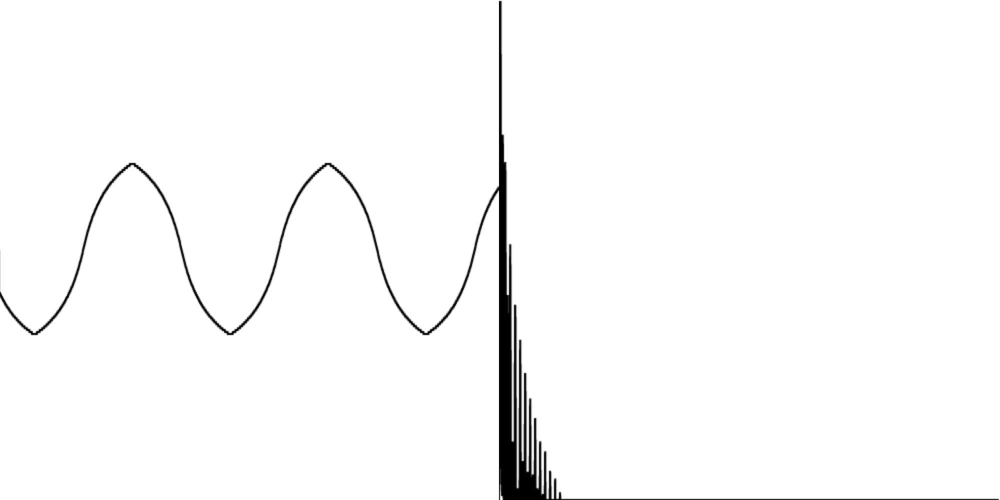

# Browser beats I: synthesizing a kick drum

Because I wanted to gain some experience in working with [Angular](https://angular.io/) and [NgRx](https://ngrx.io/), I started building a sample-based step sequencer that runs in the browser.
To do that, I had to dive into the [Web Audio API](https://developer.mozilla.org/en-US/docs/Web/API/Web_Audio_API).
I'll write something about that step sequencer later.
First, I want to take a look at the basics of the Web Audio API and try to synthesize a kick drum.

## The basis

At the basis of most syntesized kick drums, there's a sine wave, or something that's close to a sine wave.
The function below produces a sine wave with a frequency of 55Hz that plays for the duration of ten seconds.

```js
const play = () => {
    const audioContextClass = window.AudioContext || window.webkitAudioContext;
    const audioContext = new audioContextClass();

    const sine = audioContext.createOscillator();
    sine.type = 'sine';
    sine.frequency.value = 55;

    sine.start(audioContext.currentTime);
    sine.stop(audioContext.currentTime + 10);
}
```

It sounds like this:
(You might not hear it without head phones.)

<audio controls src="audio/sine-55Hz.mp3"></audio>

When you visualize that sound, as shown below, you'll see why it's called a sine wave.
The left-hand side of the figure shows the waveform, and the right-hand side shows the [sound spectrum](https://newt.phys.unsw.edu.au/jw/sound.spectrum.html).


The sound spectrum is almost completely empty, except for a narrow spike at the rightmost end.
This explains why you might not hear the sound over your laptop speakers, for example.
Not all speakers are capable of reproducing sounds at low frequencies.
You can emulate the frequency response of such speakers by applying a high-pass filter.
If you filter out all frequencies below 120Hz, this is what's left of our sine wave:

<audio controls src="audio/sine-55Hz-high-pass-120Hz.mp3"></audio>

The graphs below further illustrate that not much is left of the original sound.


What does that mean for our synthesized kick drum?
We'll apply a trick to make your ears believe that there's still some bass to be heard, even when listening to speakers that can't reproduce low frequencies very well.
Instead of a sine wave, we'll start out with a triangle wave.

```js
const play = () => {
    const audioContextClass = window.AudioContext || window.webkitAudioContext;
    const audioContext = new audioContextClass();

    const triangle = audioContext.createOscillator();
    triangle.type = 'triangle';
    triangle.frequency.value = 55;

    triangle.connect(audioContext.destination);

    triangle.start(audioContext.currentTime);
    triangle.stop(audioContext.currentTime + 10);
}
```

Without further processing, it will look like this:


It's again clear where the name comes from.
It's also clear that there's much more going on in the spectrum graph.

Unfortunately, it sounds a little abrasive, like this:

<audio controls src="audio/triangle-55Hz.mp3"></audio>

Ideally, we'd like to process this triangle wave in such a way that it sounds more like the sine wave, without cutting off too much of the high-frequency sounds.
We can do that using a [wave shaper](https://developer.mozilla.org/en-US/docs/Web/API/WaveShaperNode).

```js
const distortionCurve = (amount) => {
    const numberOfSamples = 44100;
    const curve = new Float32Array(numberOfSamples);
    const deg = Math.PI / 180;
    for (let i = 0; i < numberOfSamples; ++i) {
        const x = i * 2 / numberOfSamples - 1;
        curve[i] = (3 + amount) * x * 20 * deg / ( Math.PI + amount * Math.abs(x) );
    }
    return curve;
};

const play = () => {
    const audioContextClass = window.AudioContext || window.webkitAudioContext;
    const audioContext = new audioContextClass();

    const triangle = audioContext.createOscillator();
    triangle.type = 'triangle';
    triangle.frequency.value = 55;

    const waveShaper = audioContext.createWaveShaper();
    waveShaper.curve = distortionCurve(5);

    triangle.connect(waveShaper);
    waveShaper.connect(audioContext.destination);

    triangle.start(audioContext.currentTime);
    triangle.stop(audioContext.currentTime + 10);
}
```

The curve I'm using above comes from a [Stack Overflow](https://stackoverflow.com/questions/22312841/waveshaper-node-in-webaudio-how-to-emulate-distortion) answer by [Kevin Ennis](https://stackoverflow.com/users/717965/kevin-ennis).
In theory, there are multiple [Sigmoid functions](https://en.wikipedia.org/wiki/Sigmoid_function) that you could use.
I only tried this one and stuck with it because I liked the result.

Speaking of results, here are the graphs for this sound:



The triangles look a lot more like sines, and there is still something going on at the higher end of the frequency spectrum.
The resulting sound sounds like this:

<audio controls src="audio/triangle-55Hz-waveshaper.mp3"></audio>

The [W3C spec](https://webaudio.github.io/web-audio-api/#dom-waveshapernode-curve) gives a good explanation of what's actually going on when you apply a wave shaper with a certain curve.
I won't go into the details here.

What did we achieve with this detour?
If we filter out the low frequencies again to simulate cheaper speakers, we end up with the following sound:

<audio controls src="audio/triangle-55Hz-waveshaper-high-pass.mp3"></audio>

The graphs for this filtered sound are shown below.
When you compare these to the ones for the filtered sine wave shown above, you'll notice that there's still something to hear after removing the low end.
This is enough for you ears to trick you into believing that there's actually some low end left, even when there isn't.


## Make it boom

The sound we ended up with sounds a little like "WOOOOOOOOOOH".
Let's turn that into a "WOOOOM".

```js
const play = () => {
    const audioContextClass = window.AudioContext || window.webkitAudioContext;
    const audioContext = new audioContextClass();

    const triangle = audioContext.createOscillator();
    triangle.type = 'triangle';
    triangle.frequency.value = 55;

    const waveShaper = audioContext.createWaveShaper();
    waveShaper.curve = distortionCurve(5);

    const triangleGainNode = audioContext.createGain();
    triangleGainNode.gain.value = 1;
    triangleGainNode.gain.linearRampToValueAtTime(0, audioContext.currentTime + 0.6)

    triangle.connect(waveShaper);
    waveShaper.connect(triangleGainNode);
    triangleGainNode.connect(audioContext.destination);

    triangle.start(audioContext.currentTime);
    triangle.stop(audioContext.currentTime + 1);
}
```

In the snippet above, you'll see that we're using a gain node to gradually fade out over the course of 600 milliseconds.
The end result sounds like this.

<audio controls src="audio/release.mp3"></audio>

Now that we have something that sounds like "WOOOOM", let's make it sound like "BOOOOM".

```js
const play = () => {
    const audioContextClass = window.AudioContext || window.webkitAudioContext;
    const audioContext = new audioContextClass();

    const triangle = audioContext.createOscillator();
    triangle.type = 'triangle';
    triangle.frequency.value = 220;
    triangle.frequency.exponentialRampToValueAtTime(55, audioContext.currentTime + 0.1);

    const waveShaper = audioContext.createWaveShaper();
    waveShaper.curve = distortionCurve(5);

    const triangleGainNode = audioContext.createGain();
    triangleGainNode.gain.value = 1;
    triangleGainNode.gain.linearRampToValueAtTime(0, audioContext.currentTime + 0.6)

    triangle.connect(waveShaper);
    waveShaper.connect(triangleGainNode);
    triangleGainNode.connect(audioContext.destination);

    triangle.start(audioContext.currentTime);
    triangle.stop(audioContext.currentTime + 1);
}
```

As shown above, we do that be quickly lowering the frequency of the triangle wave from 220Hz to 55Hz over the course of 100 milliseconds.
The end result sounds like this:

<audio controls src="audio/pitch.mp3"></audio>

If you want to achieve more of a 90s Euro house vibe, you can drop down from a higher frequency.

<audio controls src="audio/pitch-extreme.mp3"></audio>

## White noise

If you look at [how classic synthesizers emulate kick drums](https://www.soundonsound.com/techniques/practical-bass-drum-synthesis), you'll see that they'll often use a little white noise to give the kicks a little more body.
The Web Audio API doesn't provide (white) noise out of the box, but you can use an audio buffer to [create your own](https://noisehack.com/generate-noise-web-audio-api/).

```js
const generateWhiteNoiseBuffer = (numberOfSamples) => {
    const buffer = audioContext.createBuffer(1, numberOfSamples, audioContext.sampleRate);

    const data = buffer.getChannelData(0);
    for (let i = 0; i < numberOfSamples; ++i) {
        data[i] = Math.random() * 2 - 1;
    }

    return buffer;
}

const whiteNoiseBuffer = generateWhiteNoiseBuffer(audioContext.sampleRate);

const whiteNoiseBufferSource = () => {
    const bufferSource = audioContext.createBufferSource();
    bufferSource.buffer = whiteNoiseBuffer;
    bufferSource.loop = true;
    bufferSource.loopEnd = audioContext.sampleRate
    return bufferSource;
}
```

Each buffer source returned by the function `whiteNoiseBufferSource` can only be started once.
The same holds for the oscillator nodes that we've been creating above.
The buffer returned by `generateWhiteNoiseBuffer`, however, can be reused.
The result sounds like this:

<audio controls src="audio/white-noise.mp3"></audio>

The next step is to apply a fade to this sound, just like we did before.

<audio controls src="audio/white-noise-release.mp3"></audio>

After that, we cut of most of the higher frequencies using a low pass filter.

```js
const play = () => {

    ...

    const noise = whiteNoiseBufferSource();

    const noiseGainNode = audioContext.createGain();
    noiseGainNode.gain.value = 1;
    noiseGainNode.gain.linearRampToValueAtTime(0, audioContext.currentTime + 0.2);

    const noiseFilter = audioContext.createBiquadFilter();
    noiseFilter.type = 'lowpass';
    noiseFilter.frequency.value = 120;

    noise.connect(noiseGainNode);
    noiseGainNode.connect(noiseFilter);
    noiseFilter.connect(audioContext.destination);

    noise.start(audioContext.currentTime);
    noise.stop(audioContext.currentTime + 1);
};
```

The end result sounds like this:

<audio controls src="audio/white-noise-low-pass.mp3"></audio>

## End result

Combining the sine-like wave and the filtered white noise leads to the following result:

<audio controls src="audio/triangle-and-noise.mp3"></audio>

All you need is a handful of other instruments and you're halfway making the next big dance hit, in your browser.

## Conclusion

Let's put the results of all this hard work into action.
First, open Youtube, Spotify or whatever streaming service you like to play your favorite song.
Then, visit [https://ljpengelen.github.io/groovid19/kick-snare-hihat.html](https://ljpengelen.github.io/groovid19/kick-snare-hihat.html) and press `q`, `w`, and `e` to drum along.
Enjoy!
